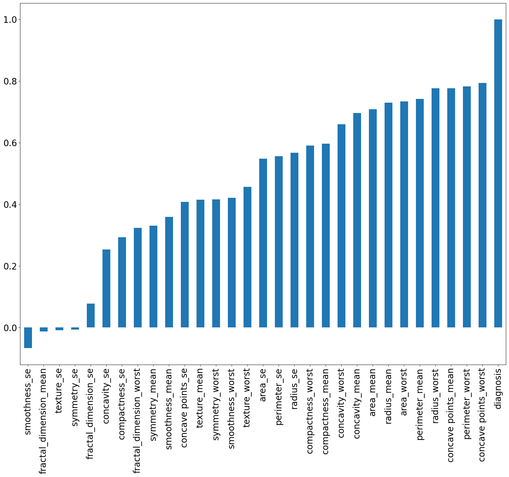
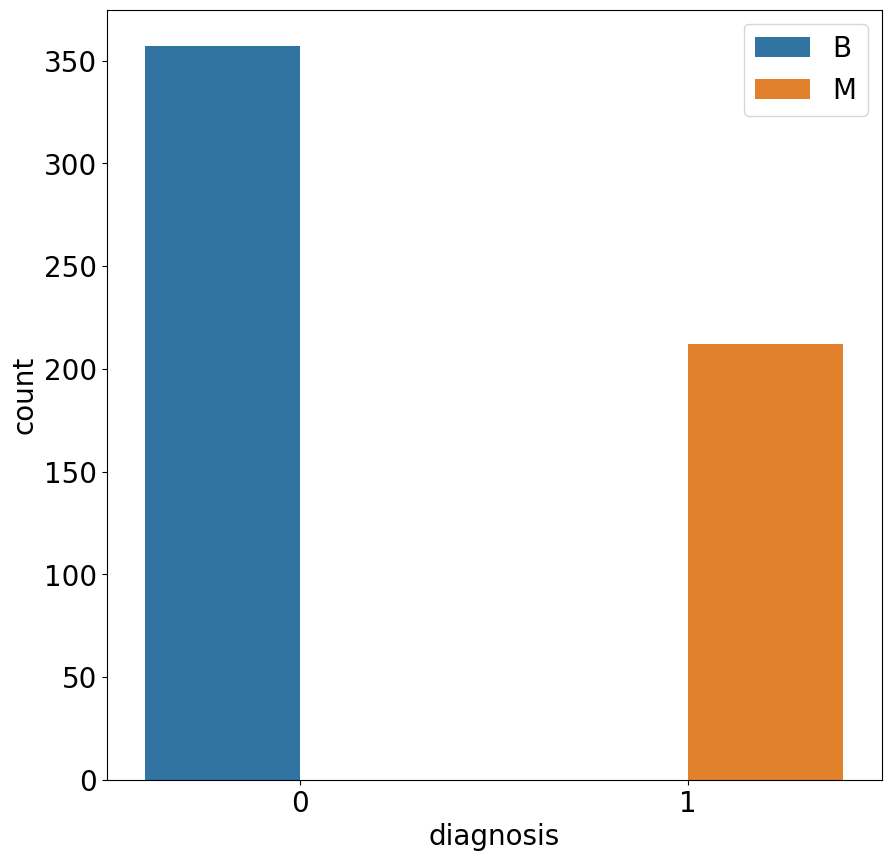

# Proyecto Regresión Logistica Binomial

## Proyecto de regresión logística binomial sobre la detección del cancer de seno

El proyecto consiste en la aplicación de un modelo de regresión logística binomial para la detección del cáncer de seno, con el objetivo de predecir si un cáncer es benigno o maligno. Se utilizan diez características de valor real para cada núcleo celular obtenidas a partir de imágenes digitalizadas de un aspirado con aguja fina (AAF) de una masa mamaria. En total, se calculan 30 características a partir de la media, el error estándar y el "peor" o mayor de cada una de las características iniciales. La distribución por clases del conjunto de datos es de 357 casos benignos y 212 malignos, y no se tienen valores de atributo perdidos.

## Analisis de correlacion entre la variable independiente vs dependiente

## Analisis exploratorio (Cantidad de datos divididos por su diagostico Beningno = B o Maligno = M)

## Analisis de resultados (Matriz de confusión)

